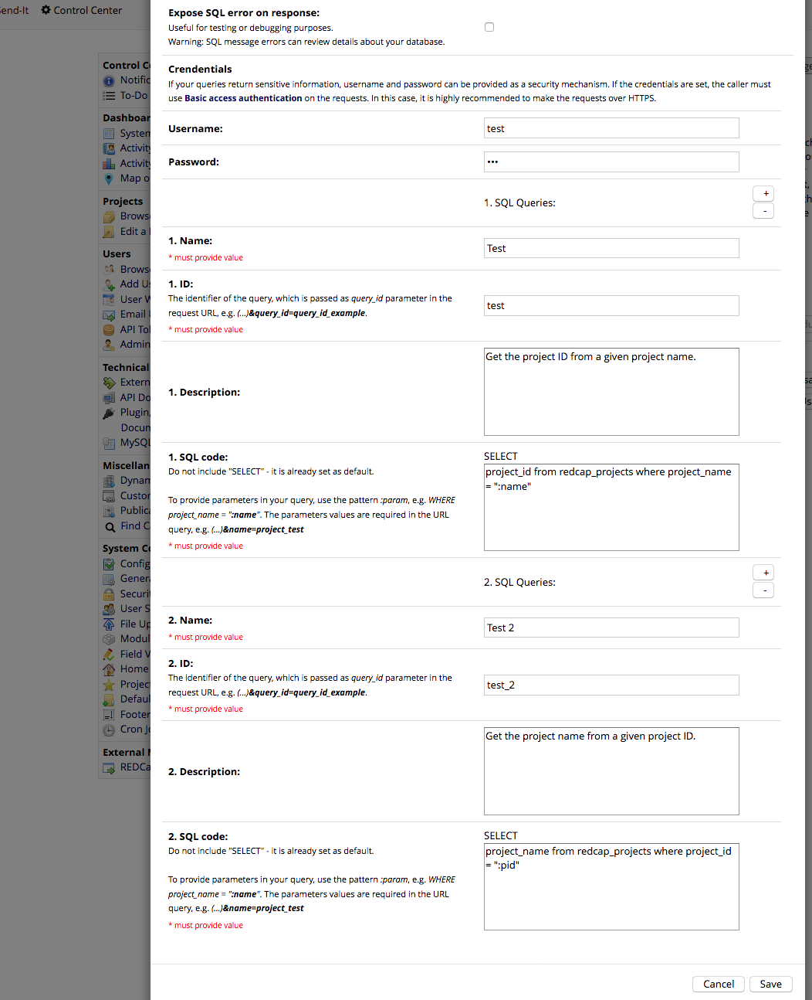
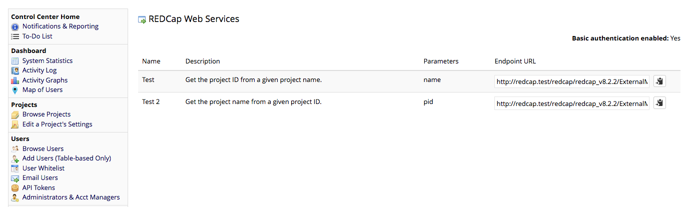

# REDCap Web Services
Provides a way to expose SQL query results to the external world.

## Motivation
The motivation of this project is the use case where an external website needs to display statistics of a given REDCap project or a REDCap system. A solution for that is to give the client an endpoint that returns a JSON containing the results of a SQL query. SQL queries are statically defined within the web service to allow admins to verify queries are written to only return summary data with no risk of exposing sensitive data.

## Prerequisites
- REDCap >= 8.0.3

## Installation
- Clone this repo into to `<redcap-root>/modules/redcap_webservices_v<version_number>`.
- Go to **Control Center > External Modules** and enable REDCap Web Services.

## How to use it

### Configuration form
To register your SQL queries, go to **Control Center > External Modules** and click on REDCap Web Services configure button. Here is an example of a working configuration:



### Endpoints page

The resulting list of endpoints can be seen at **Control Center > REDCap Web Services**:




### Response examples

Here is an example of a successful response from endpoint `test` defined, in the example above:

``` json
{
    "success": true,
    "data": [
        {
            "project_id": "13"
        }
    ]
}
```

Here is the response when the user credentials are not provided:

``` json
{
    "success": false,
    "error_msg": "Missing user."
}
```

Here is the response when a required parameter is not specified in the URL:

``` json
{
    "success": false,
    "error_msg": "Missing param 'name'."
}
```

There are other error handlings available, which are not shown on these examples.

## Features included

### Parameterized SQL queries
You may provide parameters to your SQL queries by using the pattern `:param`, e.g. `(...) WHERE project_name = :name`. The parameters are required in the endpoint URL query, e.g. `https://yourEndpoint?(...)&name=project_test`.

#### Project ID parameter
If you specify a `:pid` parameter in your query, the service will only work for projects that have REDCap Web Services enabled. It is a good way to restrict the service scope.

__Important:__ To avoid SQL injection, every non numeric parameter provided is quoted by this module. So __do not quote your parameters__, no matter if it is a string or not. For example, the following query won't work properly: `(...) WHERE project_name = ":name"`.

### Basic access authentication
If your queries return sensitive information, username and password can be provided as a security mechanism. If the credentials are set, the caller must use [Basic access authentication](https://en.wikipedia.org/wiki/Basic_access_authentication) on the requests. In this case, it is highly recommended to make the requests over HTTPS.

Here is an example of how to test your endpoint with authentication using CURL (user `test`, password `123`):

``` shell
$ curl --user test:123 '<YOUR_ENDPOINT_URL>'
```

Using AJAX (unsafe for public applications):

``` javascript
$.ajax({
    url: '<YOUR_ENDPOINT_URL>',
    headers: { 'Authorization': 'Basic ' + btoa('test:123') }
}).success(function(data) {
    // Do stuff.
});
```

### SQL syntax errors on response
If some SQL query returns an error, you may output a detailed error message in the JSON response by enabling the flag "Expose SQL error on response". Be careful, since error messages can expose details about your query. This feature is useful for testing purposes.

### Additional query examples

Here are some examples of queries that produce deidentified summary data that could be used to measure the data collection effort of a study

* Return the record for a project identified by its project_id

```
record_count
from redcap_record_counts
where project_id = :project_id
```

Returns

```
{
  "success": true,
  "data": [
    {
      "record_count": "25"
    }
  ]
}
```

* Count the number of study participants at each site on a project specified by "pid"

```
value, rcdag.group_name, count(*) as qty
from redcap_data as rcd
inner join redcap_data_access_groups as rcdag on (rcd.value = rcdag.group_id)
where field_name = "__GROUPID__" and rcd.project_id = :pid
group by value
```

Returns

```
{
  "success": true,
  "data": [
    {
      "value": "1",
      "group_name": "FSU",
      "qty": "2"
    },
    {
      "value": "2",
      "group_name": "UF",
      "qty": "2"
    }
  ]
}
```

* Show the number of new informed consents by week

Assuming the date of every informed consent form is recorded in a REDCap field identified by "consent_date_field" and a project is identified by "pid" you could group the dates of consent by week with this query

```
concat_ws("-", year(value), week(value)) as icf_week, count(*) as qty
from redcap_data as rcd
where field_name = ":consent_date_field" and rcd.project_id = :pid
group by icf_week
order by icf_week asc
```

Returns

```
{
  "success": true,
  "data": [
    {
      "icf_week": "2017-49",
      "qty": "1"
    },
    {
      "icf_week": "2017-50",
      "qty": "12"
    },
    {
      "icf_week": "2017-51",
      "qty": "3"
    },
    {
      "icf_week": "2018-0",
      "qty": "1"
    },
    {
      "icf_week": "2018-1",
      "qty": "1"
    },
    {
      "icf_week": "2018-2",
      "qty": "1"
    }
  ]
}
```

* Show project and user activity summary

```
(SELECT count(*)  as n
FROM ctsi_redcap.redcap_projects
where date_deleted is null) as count_of_existing_projects,
(select count(*) as n
from redcap_user_information
where user_suspended_time is NULL) as count_of_users,
(SELECT count(*)  as n
FROM ctsi_redcap.redcap_projects
where date_deleted is null and
datediff(now(), creation_time) <= 30) as count_of_projects_created_in_the_past_30_days,
(SELECT count(*)  as n
FROM ctsi_redcap.redcap_projects
where date_deleted is null and
datediff(now(), production_time) <= 30) as count_of_projects_moved_to_production_in_the_past_30_days,
(select count(*) as n
from redcap_user_information
where datediff(now(), user_lastactivity) <= 30
and user_suspended_time is NULL) as count_of_users_active_in_the_past_30_days,
(select count(*) from redcap_projects
where 
last_logged_event is not null and 
date_deleted is null and 
datediff(now(), last_logged_event) <= 30) as count_of_projects_active_in_the_past_30_days
from dual
```

Returns

```
{
  "success": true,
  "data": [
    {
      "count_of_existing_projects": "3296",
      "count_of_users": "3232",
      "count_of_projects_created_in_the_past_30_days": "119",
      "count_of_projects_moved_to_production_in_the_past_30_days": "49",
      "count_of_users_active_in_the_past_30_days": "1370",
      "count_of_projects_active_in_the_past_30_days": "760"
    }
  ]
}
```
