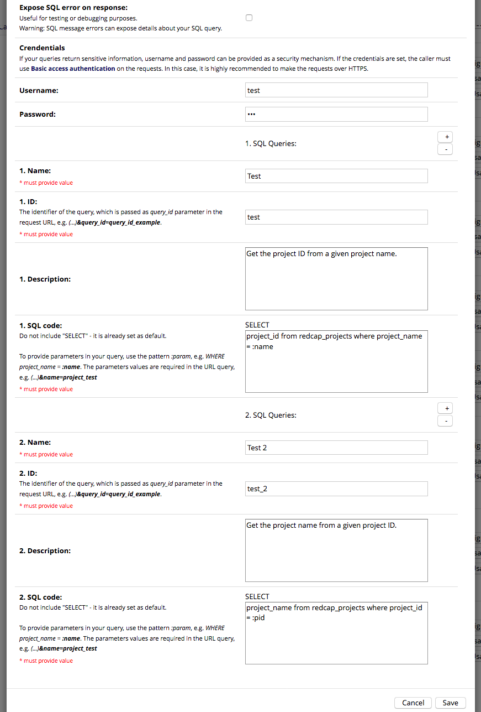

# REDCap Web Services
Provides a way to expose SQL query results to the external world.

## Motivation
The motivation of this project is the use case where an external website needs to display statistics of a given REDCap project. A solution for that is to give the client an endpoint that returns a JSON containing the results of a SQL query. That's basically how this module works.

## Prerequisites
- REDCap >= 8.0.3

## Installation
- Clone this repo into to `<redcap-root>/modules/redcap_webservices_v<version_number>`.
- Go to **Control Center > External Modules** and enable REDCap Web Services.

## How to use it

### Configuration form
To register your SQL queries, go to **Control Center > External Modules** and click on REDCap Web Services configure button. Here is an example of a working configuration:



### Endpoints page

The resulting list of endpoints can be seen at **Control Center > REDCap Web Services**:


### Response examples

Here is an example of a well succeeded response from endpoint `test` defined, in the example above:

``` json
{
    "success": true,
    "data": [
        {
            "project_id": "13"
        }
    ]
}
```

Here is the response when the user credentials are not provided:

``` json
{
    "success": false,
    "error_msg": "Missing user."
}
```

Here is the response when a required parameter is not specified in the URL:

``` json
{
    "success": false,
    "error_msg": "Missing param 'name'."
}
```

There are other error handlings available, which are not shown on these examples.

## Features included

### Parameterized SQL queries
You may provide parameters to your SQL queries by using the pattern `:param`, e.g. `(...) WHERE project_name = ":name"`. The parameters are required in the endpoint URL query, e.g. `https://yourEndpoint?(...)&name=project_test`.

#### Project ID parameter
If you specify a `:pid` parameter in your query, the service will only work for projects that have REDCap Web Services enabled. It is a good way to restrict the service scope.

### Basic access authentication
If your queries return sensitive information, username and password can be provided as a security mechanism. If the credentials are set, the caller must use [Basic access authentication](https://en.wikipedia.org/wiki/Basic_access_authentication) on the requests. In this case, it is highly recommended to make the requests over HTTPS.

Here is an example of how to test your endpoint with authentication using CURL (user `test`, password `123`):

``` shell
$ curl --user test:123 '<YOUR_ENDPOINT_URL>'
```

Using AJAX (unsafe for public applications):

``` javascript
$.ajax({
    url: '<YOUR_ENDPOINT_URL>',
    headers: { 'Authorization': 'Basic ' + btoa('test:123') }
}).success(function(data) {
    // Do stuff.
});
```

### SQL syntax errors on response
If some SQL query returns an error, you may output a detailed error message in the JSON response by enabling the flag "Expose SQL error on response". Be careful, since error messages can expose details about your query. This feature is useful for testing purposes.
